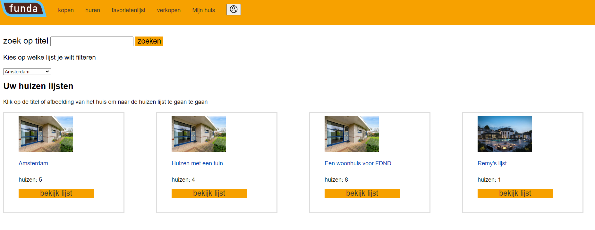

> _Fork_ deze leertaak en ga aan de slag. Onderstaande outline ga je gedurende deze taak in jouw eigen GitHub omgeving uitwerken. De instructie vind je in: [docs/INSTRUCTIONS.md](docs/INSTRUCTIONS.md)

# Titel
<!-- Geef je project een titel en schrijf in één zin wat het is -->

## Inhoudsopgave

  * [Beschrijving](#beschrijving)
  * [Gebruik](#gebruik)
  * [Kenmerken](#kenmerken)

  * [Bronnen](#bronnen)
  * [Licentie](#licentie)

## Beschrijving
<!-- Bij Beschrijving staat kort beschreven wat voor project het is en wat je hebt gemaakt -->
<!-- Voeg een mooie poster visual toe 📸 -->
<!-- Voeg een link toe naar Github Pages 🌐-->

Hier kan je als gebruiker je huizenlijsten zien en je huizen in de lijst zien


## Gebruik en installaite
<!-- Bij Gebruik staat de user story, hoe het werkt en wat je er mee kan. -->
<p>Als gebruiker wil ik mijn bewaarde huizen kunnen zien en er een score aan kunnen geven
en ik wil de huizenlijsten van andere kunnen zien
</p>

### installatie
Je drukt op de groen knop downloaden als zip daarna kan je de zip map uitpakken
verder heb je een code editor zoals visual studio code nodig ook moet je node js geinstalleerd hebben en dan kan je in de 
code editor het project openen en
vervolgens voer je in je terminal


```
npm install
```
en daarna 
```
npm start om het programma op te starten
```
en dan zie je verolgens localhost:8000
## Kenmerken
<!-- Bij Kenmerken staat welke technieken zijn gebruikt en hoe. Wat is de HTML structuur? Wat zijn de belangrijkste dingen in CSS? Wat is er met JS gedaan en hoe? Misschien heb je iets met NodeJS gedaan, of heb je een framwork of library gebruikt? -->
<ul>
<li>Express</li>
<li>EJS</li>
<li>Node js</li>
<li>css voor de styling</li>

</ul>
<p>

</p>

## Bronnen

## Licentie

This project is licensed under the terms of the [MIT license](./LICENSE).
